# GYMFLOW

## Sistema de Gerenciamento de Treinos de Academia

GYMFLOW é uma API REST desenvolvida para gerenciamento de treinos de academia. O sistema permite o cadastro de usuários, alunos, treinadores, exercícios, treinos e o acompanhamento da evolução dos alunos.

O projeto foi desenvolvido como avaliação das disciplinas de Desenvolvimento Web, Banco de Dados e Infraestrutura de Sistemas Web.

---

## Caminho Escolhido

Este projeto segue a **Opção A: Infraestrutura Baseada em Contêineres (Docker)**.

A orquestração é feita via `docker-compose.yml`, com automação de build e publicação de imagem via GitHub Actions (CI/CD) integrada ao GitHub Container Registry (GHCR).

---

# Tecnologias Utilizadas

* Node.js 24
* Express
* PostgreSQL 17
* Sequelize ORM
* Redis
* Nginx
* Docker e Docker Compose
* GitHub Actions (CI/CD)
* JWT
* Bcrypt
* Swagger

---

# Arquitetura

```text
Host
   │
   ▼
Nginx (Proxy Reverso) ── porta 80 exposta
   │
   ▼
Node.js / Express (gymflow-app) ── sem porta exposta ao host
   │
   ├────────► Redis (gymflow-cache)
   │
   ▼
PostgreSQL (gymflow-db) ── sem porta exposta ao host
```

A aplicação segue o modelo de proxy reverso, onde apenas o Nginx possui acesso externo (porta 80).

O servidor Node.js permanece acessível apenas pela rede interna do Docker.

O banco PostgreSQL e o Redis não possuem portas expostas para o host.

---

# Banco de Dados

O projeto utiliza PostgreSQL por oferecer:

* banco relacional robusto;
* conformidade ACID;
* suporte a relacionamentos complexos;
* excelente integração com Sequelize.

## Entidades

* Usuários
* Alunos
* Personais
* Exercícios
* Treinos
* Histórico
* Progresso

## Relação N:N

O sistema possui relacionamento muitos-para-muitos entre:

Treinos ↔ Exercícios

através da tabela pivô:

```text
TreinoExercicios
```

## Modelagem

Os arquivos de modelagem encontram-se na pasta:

```text
modelagem/
```

Contendo:

* DER
* Modelo Lógico
* Dicionário de Dados

---

# Containers Utilizados

| Container            | Imagem              | Finalidade                | Rede(s)                      | Porta exposta ao host |
| --------------------- | ------------------- | -------------------------- | ----------------------------- | ---------------------- |
| gymflow-nginx-proxy   | nginx:alpine         | Proxy reverso               | proxy-network                 | 80                      |
| gymflow-app           | build local (Node)   | Servidor Node.js            | proxy-network, db-network     | nenhuma                |
| gymflow-cli           | build local (Node)   | Execução de comandos CLI    | db-network                    | nenhuma                |
| gymflow-db            | postgres:17-alpine   | Banco PostgreSQL            | db-network                    | nenhuma                |
| gymflow-cache         | redis:7-alpine       | Cache Redis                 | db-network                    | nenhuma                |

Apenas o `nginx` está exposto ao host. O `app` e o `db` se enxergam pela `db-network`, mas o `nginx` não tem acesso direto ao banco — apenas ao `app`.

--- 

# Infraestrutura

## Dockerfile

O Dockerfile do backend (`backend/Dockerfile`) utiliza:

* **Multi-stage Build**: separação entre estágio de build e estágio de runtime.
* **Imagem base Alpine** (`node:24-alpine`), reduzindo significativamente o tamanho final da imagem.
* **Cache de camadas otimizado**: o `package*.json` é copiado e instalado antes do restante do código-fonte (`COPY . .`), garantindo que o `npm ci` só seja reexecutado quando as dependências realmente mudarem.
* **Usuário não-root** (`gymflow`), em vez de rodar como root dentro do container — boa prática de segurança.
* **Arquivo `.dockerignore`** (`backend/.dockerignore`), evitando copiar `node_modules`, `.env`, `.git` e arquivos de IDE para o contexto de build.

O contexto de build do Docker (tanto no `docker-compose.yml` quanto no workflow de CI/CD) é a pasta `backend/`, e não a raiz do repositório. Isso garante que a imagem contenha apenas o necessário para rodar a API.

---

## Redes Docker

A comunicação entre os containers ocorre através de redes Docker customizadas (bridge), nunca pela rede `default` do Docker.

```text
proxy-network
  Nginx ── App

db-network
  App ── PostgreSQL
  App ── Redis
  CLI ── PostgreSQL
```

Os containers se comunicam utilizando o **nome do serviço como hostname** (DNS interno do Docker — Service Discovery nativo), nunca por IP fixo. Por exemplo, o `app` se conecta ao banco usando `DB_HOST=gymflow-db`, e o Docker resolve esse nome internamente.

O banco de dados e o Redis permanecem isolados da rede externa e do `nginx` — apenas o `app` e o `cli` têm acesso a eles.

**Evidência de DNS interno e isolamento** (comando que pode ser usado para validar):
```bash
docker network inspect gymflow_db-network
```
Esse comando mostra todos os containers conectados à rede `db-network` com seus respectivos IPs internos atribuídos dinamicamente pelo Docker — comprovando que a comunicação não depende de IPs fixos.

---

## Persistência

A persistência dos dados é realizada através de um **Named Volume** do Docker (`postgres_data`), declarado no `docker-compose.yml`.

Mesmo após parar, reiniciar ou recriar o container do banco, os dados permanecem armazenados enquanto o volume existir — diferente de um *bind mount* ou de dados gravados diretamente no sistema de arquivos do container (que seriam perdidos).

**Teste de persistência (PoC):**
```bash
# 1. Consultar dados existentes
docker compose exec db psql -U gymflow_user -d gymflow -c "SELECT * FROM exercicios LIMIT 3;"

# 2. Reiniciar o container do banco
docker compose stop db
docker compose up -d db

# 3. Consultar novamente — os dados (e o campo createdAt original) devem ser os mesmos
docker compose exec db psql -U gymflow_user -d gymflow -c "SELECT * FROM exercicios LIMIT 3;"
```

---

## Segurança

O projeto utiliza:

* Variáveis de ambiente (`.env`), nunca credenciais fixas no código.
* Autenticação JWT para rotas protegidas.
* Senhas criptografadas com bcrypt.
* Banco de dados e Redis sem portas públicas expostas ao host.
* Servidor Node acessível apenas através do Nginx (proxy reverso).
* Usuário não-root dentro do container da aplicação.

**Teste de isolamento do banco (PoC):**
```bash
# de dentro da rede do Docker — deve conectar
docker compose exec app sh -c "nc -zv gymflow-db 5432"

# do host — deve falhar/recusar
curl http://localhost:5432
```

---

# CI/CD — Automação do Pipeline

O projeto possui um pipeline de integração e entrega contínua configurado em `.github/workflows/ci-cd.yml`, disparado automaticamente em todo `push` para as branches `main` e `Carina`.

O fluxo segue as fases:

1. **Build**: build da imagem Docker a partir de `backend/Dockerfile`, com cache de camadas (`type=gha`).
2. **Tagging**: geração de tags (hash do commit e `latest`) via `docker/metadata-action`.
3. **Push**: envio da imagem para o **GitHub Container Registry (GHCR)**, equivalente ao Amazon ECR mencionado no guia para o caminho AWS.
4. **Deploy**: pull da imagem recém-publicada, validando que ela está disponível e íntegra no registry.

A evidência de execução (build + push + deploy) é gerada automaticamente a cada execução e pode ser conferida na aba **Actions** do repositório no GitHub.

---

# Bibliotecas Utilizadas

* express
* sequelize
* pg
* pg-hstore
* bcrypt
* jsonwebtoken
* dotenv
* swagger-jsdoc
* swagger-ui-express
* sequelize-cli (dev)

---

# Pré-requisitos

* Git
* Docker Desktop (com Docker Compose v2)
* WSL2 (caso esteja no Windows)

> Não é necessário ter Node.js instalado na máquina host — toda a instalação de dependências ocorre dentro da imagem Docker, durante o build.

---

# Gestão de Segredos e Configurações

O projeto utiliza um arquivo `.env` para armazenar variáveis sensíveis (credenciais de banco, segredo do JWT, etc). Esse arquivo **nunca** deve ser comitado no repositório — ele já está listado no `.gitignore`.

Para configurar o ambiente, copie o arquivo de exemplo e preencha com valores próprios:

```bash
cp .env.example .env
```

Exemplo de conteúdo do `.env.example`:

```env
DB_HOST=gymflow-db
DB_PORT=5432
DB_NAME=gymflow
DB_USER=gymflow_user
DB_PASSWORD=sua_senha_aqui
JWT_SECRET=sua_chave_secreta_aqui
JWT_EXPIRES_IN=1d
PORT=3000
```

> ⚠️ **Nunca utilize as senhas de exemplo em produção, e nunca comite o arquivo `.env` real com valores verdadeiros no GitHub.**

---

# Como Executar ("How to Up")

## 1. Clonar o repositório

```bash
git clone https://github.com/Denisemayder/Gymflow-Projeto.git
```

## 2. Entrar na pasta

```bash
cd Gymflow-Projeto
```

## 3. Instalar dependências

```bash
npm install
```

## 4. Criar o arquivo `.env`

```bash
cp .env.example .env
```

Preencha os valores necessários (usuário, senha e nome do banco, segredo do JWT).

## 5. Subir toda a infraestrutura

```bash
docker compose up -d --build
```

Esse comando builda a imagem da aplicação (via `backend/Dockerfile`) e sobe todos os 5 serviços: `nginx`, `app`, `db`, `cache` e `cli`.

Na primeira execução, o PostgreSQL cria automaticamente o banco através do script presente em `scripts/setup.sql`.

> Não é necessário rodar `npm install` manualmente — a instalação das dependências ocorre dentro do container, durante o build da imagem.

## 6. Executar as Migrations

Após a infraestrutura subir e o banco estar `healthy`:

```bash
docker compose run --rm cli node command.js migrate
```

Esse comando sobe um container temporário apenas para executar as migrations, mantendo o banco inacessível externamente em todo o processo.

---

# Documentação Swagger

Após iniciar o projeto, a documentação interativa das rotas da API fica disponível em:

```
http://localhost/api-docs
```

---

# Autenticação JWT

## Criar um usuário

```http
POST /usuarios
```

Exemplo:

```json
{
  "nome": "Admin GymFlow",
  "email": "admin@gymflow.com",
  "senha": "senha123",
  "tipo": "admin"
}
```

Tipos disponíveis: `admin`, `trainer`, `aluno`.

## Login

```http
POST /login
```

Resposta:

```json
{
  "token": "..."
}
```

## Utilizando o Token

Enviar em todas as rotas protegidas:

```
Authorization: Bearer <token>
```

## Permissões

* **Admin**: acesso total.
* **Trainer**: gerencia alunos e treinos.
* **Aluno**: consulta seus treinos, histórico e progresso.

---

# Rotas

O projeto possui CRUD completo para todas as entidades: Usuários, Alunos, Personais, Exercícios, Treinos, Histórico e Progresso, além de rotas específicas para manipulação da tabela pivô `TreinoExercicios`.

---

# Evidências de Funcionamento e Verificação

Comandos que o avaliador pode usar para validar o sistema em execução:

```bash
# Ver todos os containers em execução e seus status
docker compose ps

# Ver logs da aplicação
docker compose logs app

# Testar a API (deve retornar mensagem de sucesso)
curl http://localhost/health

# Acessar a documentação Swagger
# (abrir em um navegador)
http://localhost/api-docs

# Confirmar isolamento de rede e resolução DNS interna
docker network inspect gymflow_db-network

# Confirmar que o banco NÃO é acessível diretamente do host
curl http://localhost:5432

# Confirmar que o banco É acessível pelo nome do serviço, de dentro da rede Docker
docker compose exec app sh -c "nc -zv gymflow-db 5432"
```

**URL de acesso à aplicação em execução:**
```
http://localhost/health
http://localhost/api-docs
```

---

# Troubleshooting e Limpeza

## Problemas comuns

* **Erro `Cannot find module '/app/server.js'`**: indica que o contexto de build usado não corresponde ao esperado pelo `Dockerfile`. Confirme que o `docker-compose.yml` usa `context: ./backend` e `dockerfile: Dockerfile` (não a raiz do projeto).
* **Erro `npm ci` reclamando de `package-lock.json` ausente**: confirme que os arquivos `backend/package.json` e `backend/package-lock.json` estão presentes e commitados no repositório.
* **`502 Bad Gateway` ao acessar `http://localhost/health` logo após o `up`**: o container `app` ainda pode estar inicializando ou esperando o `db` ficar `healthy`. Aguarde alguns segundos e tente novamente, ou confira com `docker compose logs app`.
* **Erro de conexão com o banco (`ECONNREFUSED`)**: confirme que o `db` está com status `healthy` (`docker compose ps`) e que as variáveis `DB_HOST`, `DB_USER`, `DB_PASSWORD` e `DB_NAME` no `.env` estão corretas.

## Diagnóstico

```bash
docker compose ps
docker compose logs app
docker compose logs db
```

## Limpeza (remover containers, redes e volumes)

```bash
docker compose down -v
```

> O `-v` remove também o volume `postgres_data`, apagando os dados do banco. Use apenas ao final da avaliação, para evitar consumo desnecessário de recursos.

---

# Estrutura do Projeto

```text
backend/
  Dockerfile
  .dockerignore
  package.json
  server.js
  command.js
  src/
justificativa/
modelagem/
nginx/
queries/
scripts/
.github/workflows/ci-cd.yml
docker-compose.yml
README.md
```

## Evidências da INFRA

1. Build e subida da infraestrutura completa (CRÍTICO)  
## docker compose up --build  
PRINT 1: build sem erro, todos os contêineres subindo, banco saudável. 
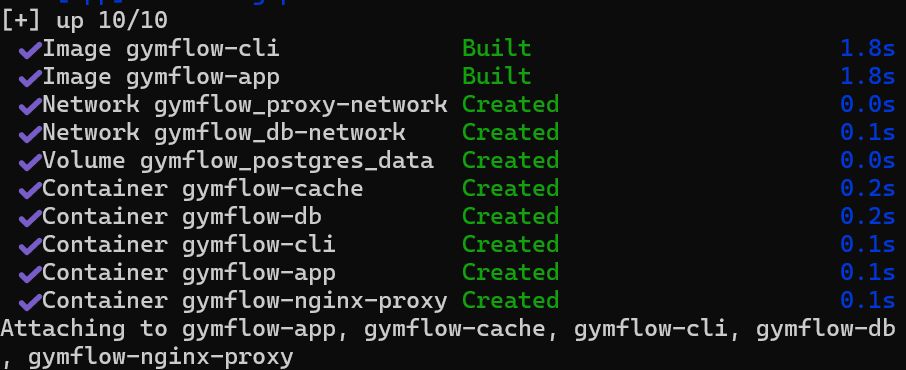
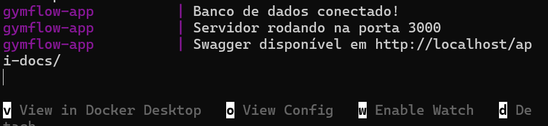

PRINT 2: mostrando os 5 serviços com statusUp (e o db como healthy). 
## docker compose ps
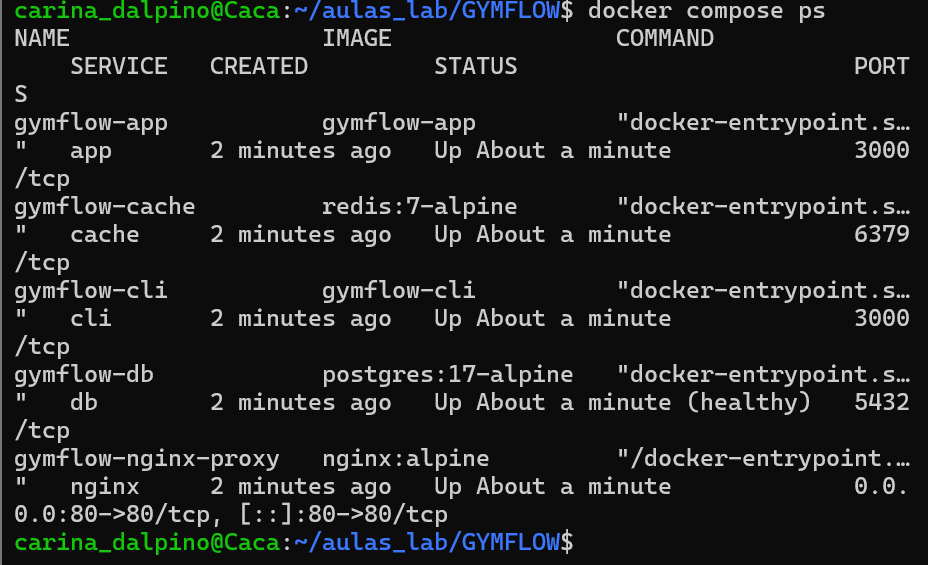

2. Prova de Domínio CLI — Custom Bridge Network e DNS interno 

PRINT 3: Saída completa em JSON, mostrando os containers(app, db, cache, cli) conectados à rede customizada, cada um com IPinterno atribuído dinamicamente (prova de que não se usa IP fixo).Evidência complementar de resolução por nome de serviço (DNS interno):  
## docker network inspect gymflow_db-network
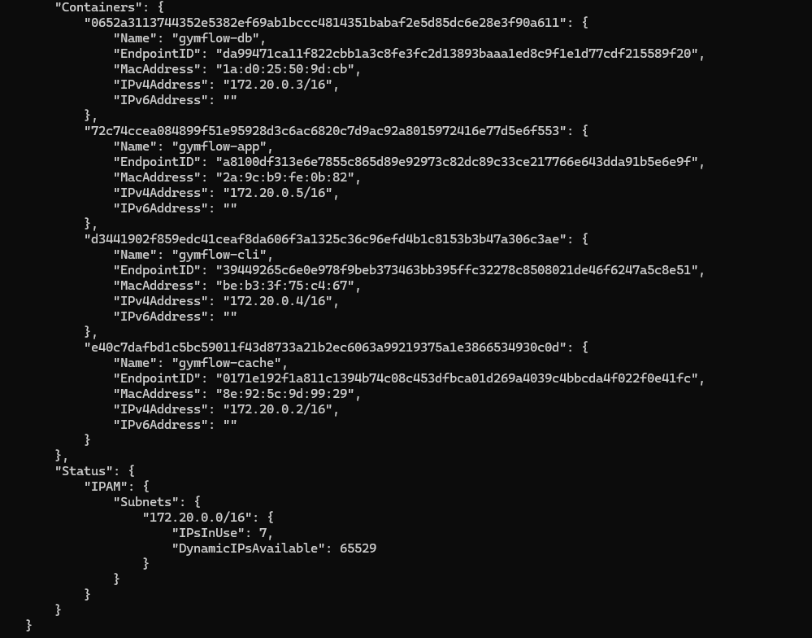

PRINT 4: Mostrando open - confirma que o app resolve e conecta nobanco usando o nome do serviço (gymflow-db), não um IP.
## docker compose exec app sh -c "nc -zv gymflow-db 5432"
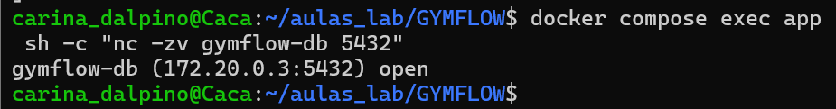

3. Logs do Pipeline de CI/CD    

PRINT 5: GitHub: https://github.com/Denisemayder/Gymflow-Projeto/actions

Build, Tag e Push para o Registry 
Deploy (atualizar serviço com a nova imagem) 
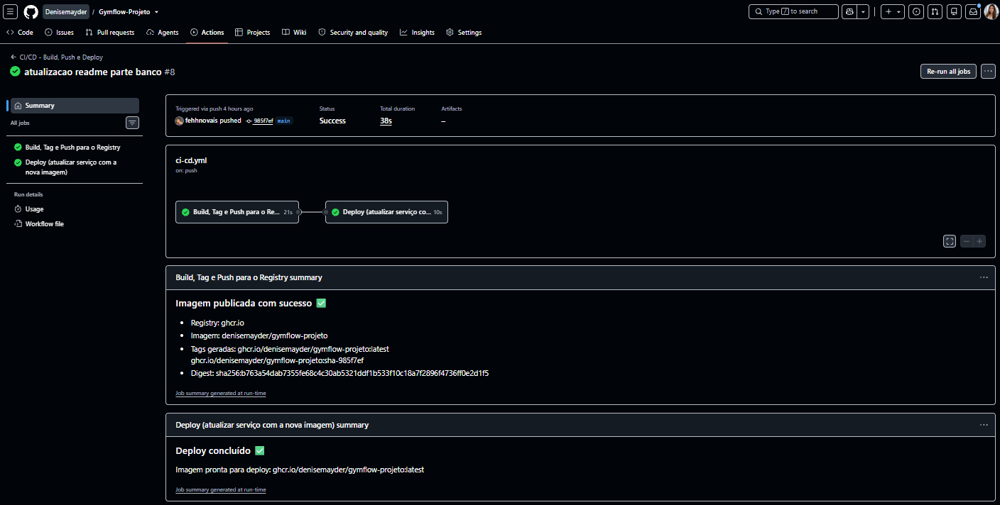

4. PoC — Persistência de Dados 
PRINT 6: captura da tabela com os registros e seus createdAt.
## docker compose exec db psql -U gymflow_user -d gymflow -c "SELECT * FROM exercicios LIMIT 3;"
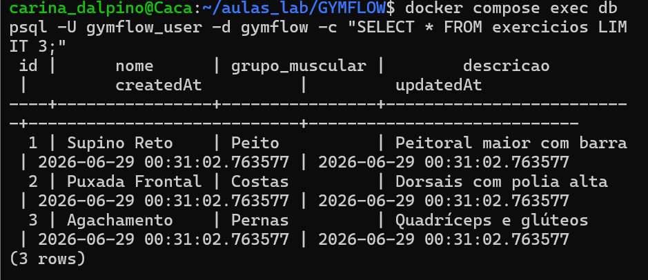

PRINT 7: captura mostrando os mesmos dados, com o mesmo createdAt —prova de que o container foi recriado, mas o volume nomeado (postgres_data)manteve os dados. 

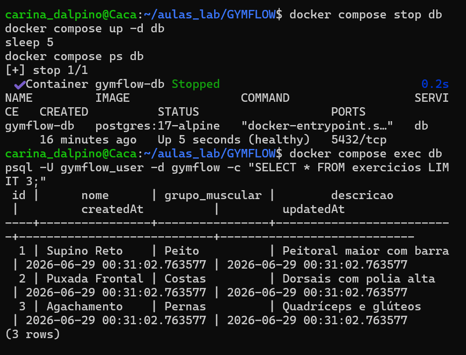

5. PoC — Segurança (isolamento do banco)  host (deve falhar): PRINT 8: captura mostrando curl: (7) Failed to connect...   
## curl http://localhost:5432
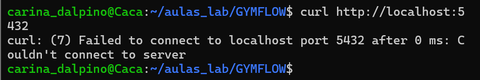
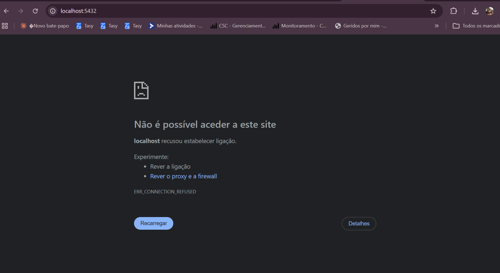

Dentro da rede Docker (deve conectar):   
## docker compose exec app sh -c "nc -zv gymflow-db 5432"
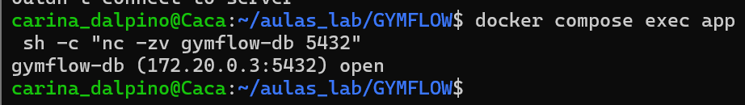
 
6. Evidência de funcionamento da aplicação (acesso via Nginx)
PRINT 9: captura mostrando HTTP/1.1 200 OK 

Rodando... 
## curl http://localhost/health
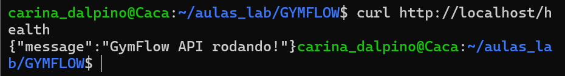

PRINT 10: captura da tela do Swagger UI carregando no navegador, com aURL visível na barra de endereço  
## Navegador - http://localhost/api-docs 
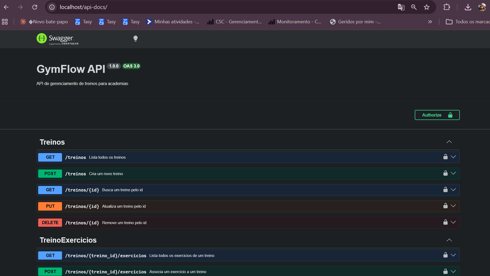


Removendo containers, redes e volumes; docker compose down -v 
## docker compose down -v
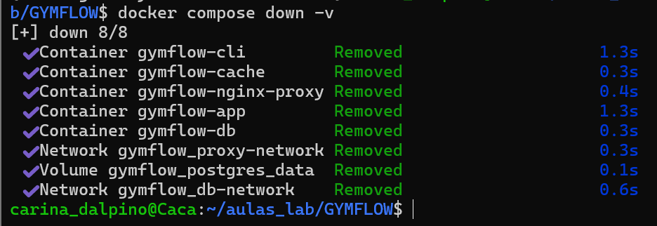
